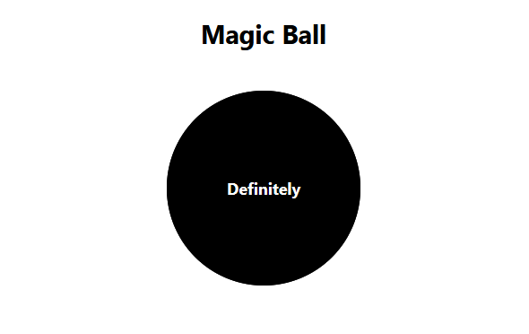

# Magic Ball

Welcome to the Magic Ball React Task! Your goal is to create a simple `MagicBall` component in React that generates random responses when it is clicked. This will simulate the experience of asking a question and receiving a mysterious answer from the "magic ball."

### Instructions

Use the sample code provided as a starting point. Ensure to structure of the React component, apply CSS styling, and implement the random response generation to complete the Magic Ball functionality.

The `answers` array is provided in the `App` component which you should pass as a prop to the `MagicBall` component that you're going to create.

Feel free to be creative with the styles and features in this task, Happy Coding!

### Getting Started

1. Fork this repository.
2. Develop the `MagicBall` component adhering to the outlined requirements.
3. Add, commit, and push your changes to your repository.
4. Create a pull request to this repository after you're done with the task.
